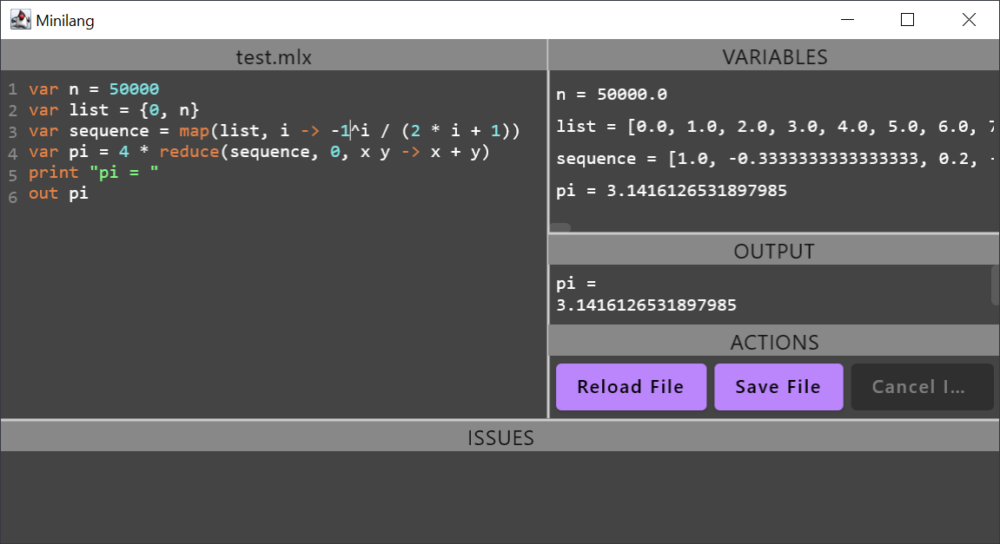

# minilang
Mini language plus interpreter/REPL

Design notes
- Either start the application without a file path to work on a memory buffer, or start it with a file path to a text file to work on that file.
- Type checks are implemented as far as possible and can be adjusted in `ExpectedTypeJudgement.kt` and `TypeValidator.kt`
- Automated boxing of sequences is implemented for convenience, i.e.: `{0, 0} + 1` results in list `[0, 1]`
- Also for convenience, other mathematical operations between sequences and numbers are supported similar to operations between mathematical vectors and scalars, e.g.: `{1, 2} * 2` results in list `[2, 4]`.
- Internally, the second parameter of the `reduce` operation is called *initial*, since that term aligns with the similar operation known from the Kotlin collections fold function. (See note in `ASTEntities.kt`)
- Reduce supports non-associative accumulator lambdas, too. In case a non-associative accumulator is given, the interpreter will compute its result sequentially. Otherwise, it will the computation will be done in parallel.
- The validation that disallows access to global variables (declared on top level) from inside lambdas can be deactivated in `DeclarationValidator.kt`. Since there are other validations in place (i.e. for name hiding and collisions) this validation is superfluous. 
- The same is true for the validation that disallows access to variables of parent lambda variables: It is superfluous for the same reason and can be deactivated in `DeclarationValidator.kt`. 

Technical notes
- Developed with IntelliJ / Kotlin / Jetpack Compose
- ANTLR4 used as parser/lexer generator
- ANTLR4 development using VSCode and ANTLR4 extension
- JUnit tests

Main features
- [x] ANTLR4 parser/lexer
- [x] AST builder, visitor
- [x] AST/program info: parent node, source code location, scopes
- [x] Scoping, type checks
- [x] Validation for missing declaration
- [x] Interpreter
- [x] Operator precedence
- [x] GUI using Jetpack Compose
- [x] Parallelism when executing map expressions (always), reduce operations (only when associative)
- [x] Interpreter cancellable
- [x] File support (read/write)
- [x] Tests for features above
- [x] Structural AST tests using generated 1000+ examples (round-trip, exception free, scopes)

How to
- run with gradle: `./gradlew run [--args="<FILE_PATH>"]`
- run with shipped jar: `java -jar build/libs/minilang-1.0.0.jar [<FILE_PATH>]`
  - Note that passing a file path is optional
- re-create jar: `./gradlew shadowJar`
- run tests with gradle: `./gradlew test`
